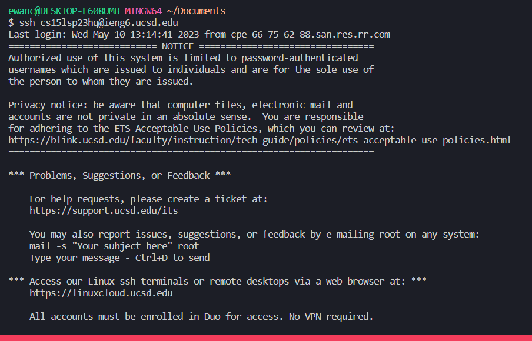
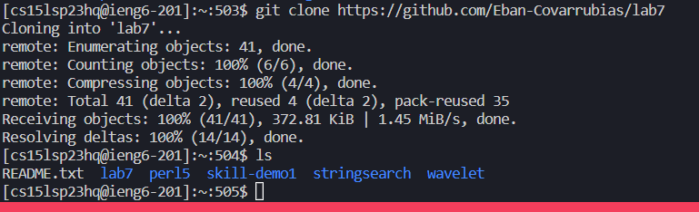
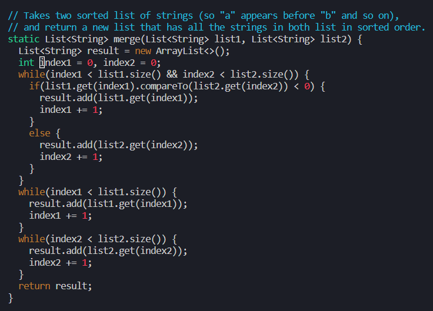
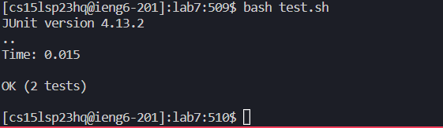
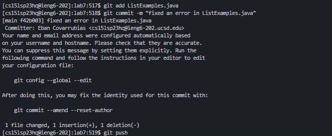

# lab-report4

# Step 1 log into account.


The keys used are ```< up >``` and ```< enter >```
  This is to access my old sign in command from my history then run it
  
# Step 2 Clone your fork of the repository from your Github account
  
  
  run command ```git clone https://github.com/Eban-Covarrubias/lab7```
  The keys I entered were the letters to type ```git clone``` and then ```^v``` to paste the github fork link and ```< enter >``` to run the command.
  
# Step 3 Run the tests, demonstrating that they fail
  
  switch into lab7 directory by using ```cd lab7/```
  The keys used for this are ```cd``` and then ```l``` and ```< tab >``` to autofill then ```< enter >```.
  Then type ```ls``` ```< enter >``` to run list command and see files inside (Optional step)
  Then we can run ```bash test.sh```
  The keys used for this are letters for ```bash``` and then ```t``` and ```< tab >``` to autofill and ```< enter >``` to run.
  
# Step 4 Edit the code file to fix the failing test
  
  Type the command ```vim ListExamples.java``` 
  The keys used are letters for ```vim``` and then ```L``` and ```< tab >``` with ```.``` and ```< tab >``` to autofill the rest of the command, we run the command with ```< enter >```
  Once we are in vim type the command ```/index1``` then click ```< enter >``` and press ```n``` 7 times to get to the correct line.
  press ```< right arrow >``` 5 times then press ```r``` and ```2``` to replace the ```1``` in ```index1``` with a ```2```.
  Type ```:``` ```w``` ```q``` ```< enter >``` to save and quit.
  
# Step 5 Run the tests, demonstrating that they now succeed
  
  press ```< up >``` two times to get to your old command of ```bash test.sh``` and press ```< enter >```
  
# Step 6 Commit and push the resulting change to your Github account (you can pick any commit message!)
  
  
  Run the commands ```git add ListExamples.java``` ```git commit -m "fixed an error in ListExamples.java"``` and ```git push```
  The key strokes are typing ```git add L``` then ```< tab >``` to autofill ListExamples. Then we click ```.``` then ```< tab >``` to autofill ```.java``` then ```< enter >```.
  The next command is done by typing ```git commit -m "fixed an error in ListExamples.java"``` and pressing ```< enter >```. Note that the string at the end can be anything you want.
  The last command is done by typing ```git push``` and ```< enter >```.
  
